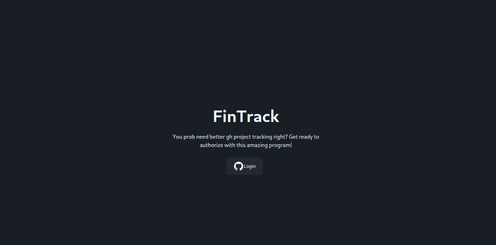

# Fintrack
A advanced github project tracker :3, this app you can create projects and manage hackatime linking, ai mangment (for the vibecoders), deadlines etc.

## Developing

Once you've created a project and installed dependencies with `npm install` (or `pnpm install` or `yarn`), start a development server:

```bash
npm run dev

# or start the server and open the app in a new browser tab
npm run dev -- --open
```

## Building

To create a production version of your app:

```bash
npm run build
```
